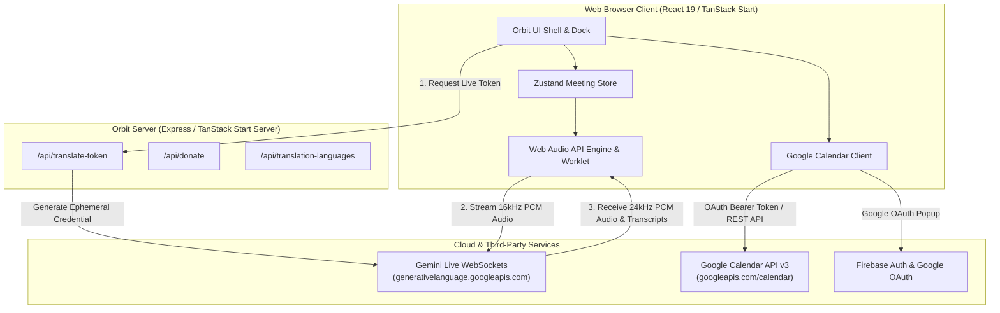
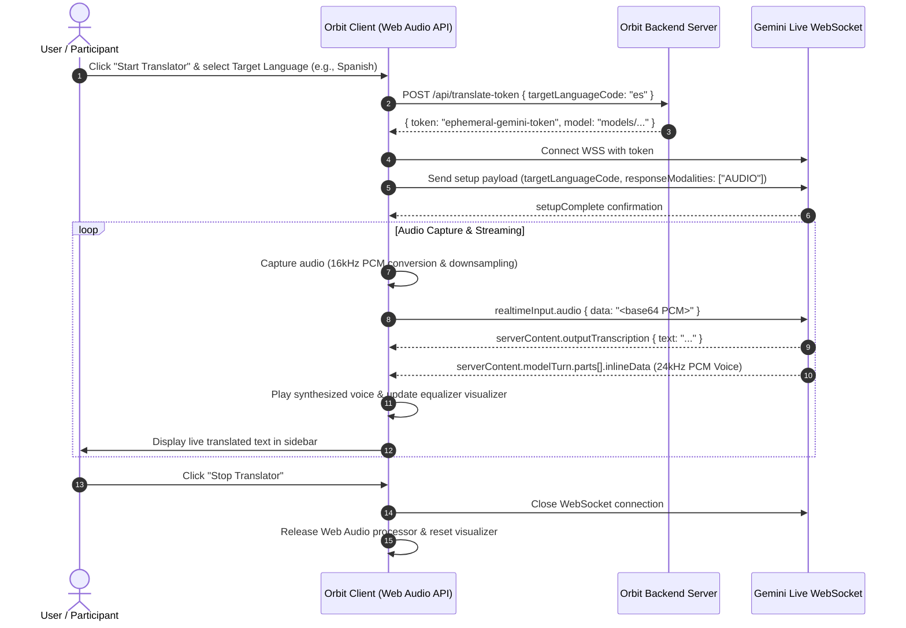
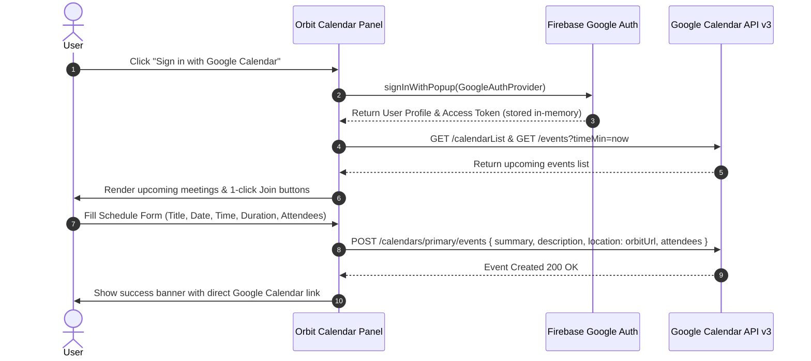

# Orbit Video Meetings & Live Speech Translator

Orbit is a modern, privacy-first web video conferencing application featuring real-time speech-to-speech AI translation (powered by Gemini Live WebSocket API across 249+ languages) and native Google Calendar synchronization.

---

## 🌟 Key Features

- **Instant Video Conferencing**:
  - Peer-to-peer and multi-party video rooms without mandatory user registration.
  - Granular in-call moderator controls: Mute/unmute all, room locking, hand raising, screen sharing, active speaker detection, and low-latency audio visualization.
  - Native keyboard shortcuts (`M` for Mute, `V` for Video, `E` for Translator, `K` for Calendar, `C` for Chat, `P` for Participants, `R` for Hand Raise).

- **Real-Time Speech-to-Speech Translation**:
  - Full support for **249+ languages** across the global Google Translate catalog.
  - Bi-directional bidirectional audio streaming over Gemini Multimodal Live WebSockets (`models/gemini-3.5-live-translate-preview` live service).
  - Audio source routing: Translate your personal microphone, incoming meeting participant audio, or system screen audio.
  - Live transcript feeds with timestamped history, copyable phrases, and voice synthesis toggling.
  - Dynamic audio visualizer synced with live voice output.

- **Google Calendar Integration**:
  - Secure Google OAuth integration with granular calendar scopes (`https://www.googleapis.com/auth/calendar.events`).
  - View upcoming schedule and join Orbit video calls in 1 click.
  - Schedule new meetings with custom Orbit room URLs, attendee email invites, and duration presets.
  - Explicit confirmation workflows for event modifications and cancellations.

---

## 🏗 System Architecture & Flow Diagrams

### 1. High-Level System Architecture



---

### 2. Live Translation Audio & WebSocket Flow



---

### 3. Google Calendar Scheduling Flow



---

## 🛠 Tech Stack

- **Framework**: [TanStack Start](https://tanstack.com/start) / React 19 / TypeScript
- **Styling**: [Tailwind CSS v4](https://tailwindcss.com/) / Lucide Icons
- **State Management**: [Zustand](https://github.com/pmndrs/zustand)
- **Audio Processing**: Web Audio API, AudioWorklet, PCM Float32 downsampler & 16-bit PCM encoder
- **AI & Translation**: Google Gemini Multimodal Live API (`@google/genai`)
- **Calendar & Auth**: Google Calendar REST API v3, Firebase Authentication (Google OAuth Provider)
- **Build & Bundler**: Vite 8, Nitro

---

## 🚀 Local Development Setup

### Prerequisites
- Node.js 22+
- npm or bun

### Installation

1. **Clone the repository**:
   ```bash
   git clone <repository-url>
   cd <project-directory>
   ```

2. **Install dependencies**:
   ```bash
   npm install
   ```

3. **Configure Environment Variables**:
   Copy or create the `.env` file (or export variables in your environment):
   ```bash
   GEMINI_API_KEY=your_gemini_api_key_here
   ```

4. **Start the development server**:
   ```bash
   npm run dev
   ```
   The application will be accessible at `http://localhost:8080` (or `http://localhost:3000`).

---

## 📦 Deployment Guide

### Option 1: Deploy to Google Cloud Run / Container

1. **Build Docker Container**:
   ```dockerfile
   FROM node:22-alpine AS builder
   WORKDIR /app
   COPY package*.json ./
   RUN npm ci
   COPY . .
   RUN npm run build

   FROM node:22-alpine AS runner
   WORKDIR /app
   ENV NODE_ENV=production
   ENV PORT=8080
   COPY --from=builder /app ./
   EXPOSE 8080
   CMD ["npm", "start"]
   ```

2. **Deploy with gcloud**:
   ```bash
   gcloud run deploy orbit-meet \
     --source . \
     --platform managed \
     --region us-central1 \
     --allow-unauthenticated \
     --set-env-vars GEMINI_API_KEY="your-gemini-key"
   ```

---

### Option 2: Deploy to Vercel

The project includes pre-configured Nitro and TanStack Start plugins with the Vercel preset.

1. Install the Vercel CLI or link via GitHub:
   ```bash
   vercel
   ```
2. Set your environment variables in the Vercel Dashboard:
   - `GEMINI_API_KEY`: Your Google Gemini API Key
3. Deploy:
   ```bash
   vercel --prod
   ```

---

## 🔒 Security & Privacy Best Practices

- **In-Memory Tokens**: Google OAuth access tokens are kept exclusively in memory and never stored in `localStorage` or `sessionStorage`.
- **Client-Side Proxy**: API routes proxy credentials on the server side (`/api/*`), ensuring no private API keys are leaked to the client bundle.
- **Microphone & Camera Control**: Tracks are stopped immediately when muting or leaving rooms to prevent unintended audio/video capture.
